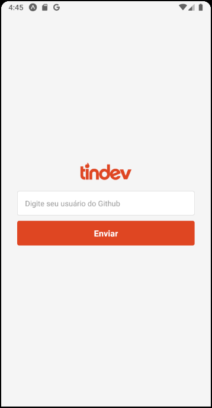
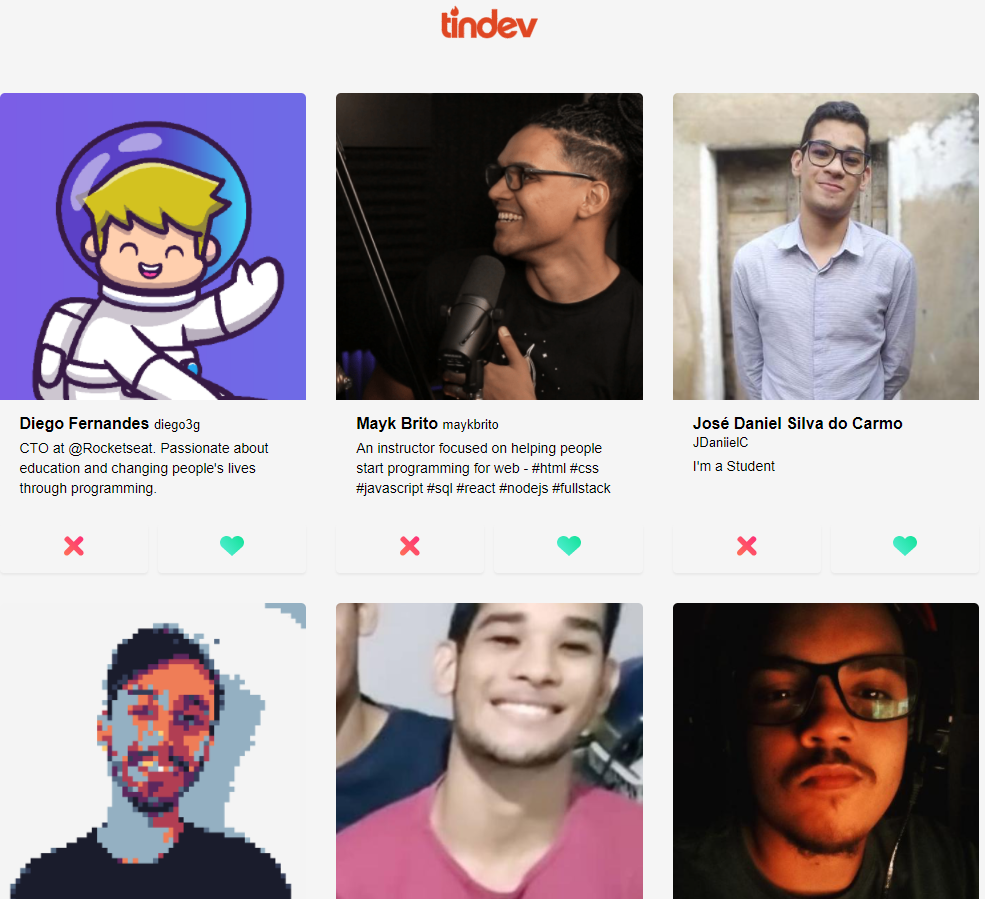

# Omnistack 8.0

<h4 align="center">
  🚀 TinDev
</h4>

<p align="left">
    
    
</p>

<h2> Projeto fullStack auxíliado pela rocketseat. </h2>



## Tecnologias

- Node.JS
- React
- React Native

## Configurado em:

- Cors
- Express
- Mongoose
- Axios

## Instalação de depedências

Configure o MongoDB e atualize a string de conexão com seu `User:Senha` no arquivo `index.js`.  

**Backend**
```bash
cd backend
yarn install
yarn dev
```

**Frontend**:
```bash
cd web
yarn install
yarn start
```
